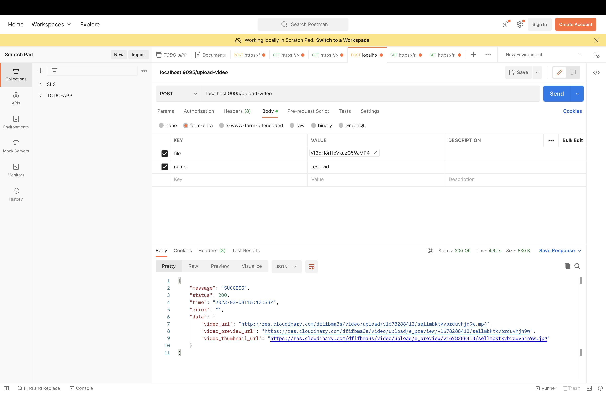

# **SOLUTION TO GOLANG ASSESSMENT**

### QUESTION 
> The task is to write an API with one endpoint, a POST /upload-video endpoint. The endpoint will accept a name string and a video attachment and upload the video file to cloudinary, then use cloudinary tools to generate a preview video for the uploaded video and a preview image for the uploaded video. <br/>
> The endpoint should return the urls for the uploaded video, the preview video and the preview image.


## **HOW TO RUN THE CODE** 

- Fill up the app .env file with  the required cloudinary credentials <br>your base url would be in the format https://api.cloudinary.com/v1_1/{{cloud_name}}/video/upload

- Run ``` docker compose up ``` to start up the application
- make a POST request to ```localhost:9095/upload-video``` using a form-data specifying the name and file as seen below <br/>
   <br/> 

- a curl request would also look like this ```curl --location --request POST 'localhost:9095/upload-video'
  --form 'file=@"file-location.mp4"'
  --form 'name="test-vid"'```


### RESULTS

- Once the request is successfully completed, you would have access to the video URL, the video preview and the video Thumbnail
- Note that the video preview would take a while (1-3 minutes) to be active because of underlying complexities with the Cloudinary Preview AI model.
- An example of the result data is <br/> ```{
  "message": "SUCCESS",
  "status": 200,
  "time": "2023-03-08T15:13:33Z",
  "error": "",
  "data": {
  "video_url": "http://res.cloudinary.com/dfifbma3s/video/upload/v1678288413/sellmbktkvbrduvhjn9w.mp4",
  "video_preview_url": "https://res.cloudinary.com/dfifbma3s/video/upload/e_preview/v1678288413/sellmbktkvbrduvhjn9w",
  "video_thumbnail_url": "https://res.cloudinary.com/dfifbma3s/video/upload/e_preview/v1678288413/sellmbktkvbrduvhjn9w.jpg"
  }
  }```